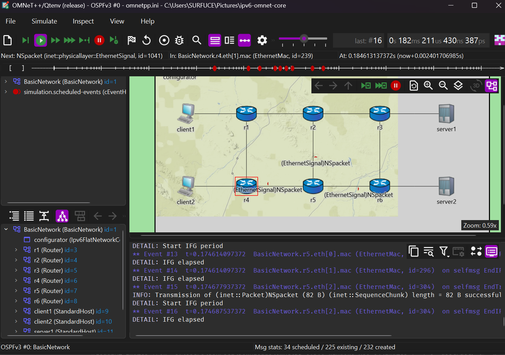

# Part I — Network Architecture Design
   

**Advanced Networks Course Project · OMNeT++ 6.3 / INET 4.5**
**Team:** @3boudi · @mamouneabdelli · @midouuk
**Status:** ✅ Final version — cleaned & ready for submission

---

## Network Topology



```
[Client1]──100Mbps──[R1]──100Mbps──[R2]──100Mbps──[R3]──100Mbps──[Server1]
                     |                |                |
                  100Mbps        10Mbps ⚠️          100Mbps
                   (BN)         BOTTLENECK           (BN)
                     |                |                |
[Client2]──100Mbps──[R4]──100Mbps──[R5]──100Mbps──[R6]──100Mbps──[Server2]
```

> ⚠️ Bottleneck link **R2↔R5: 10 Mbps / 20 ms** — intentionally constrained for congestion experiments.

---

## What This Part Does

This part builds the **core IPv6 network infrastructure** used by all other teams.

It includes:

* 6-router mesh topology with redundancy
* IPv6 addressing (`2001:db8::/32`)
* Dynamic routing: RIPng and OSPFv3
* Clean base config for Part II

No application logic here — only **topology + routing**.

---

##  What Part I Contains
 
### `BasicNetwork.ned` — Topology
 
Defines the full network structure:
 
| Element | Count | Detail |
|---------|-------|--------|
| Core Routers | 6 | R1, R2, R3, R4, R5, R6 |
| Client Hosts | 2 | Client1 (TCP), Client2 (UDP) |
| Server Hosts | 2 | Server1 (port 1000), Server2 (port 2000) |
| LAN Links | 4 | 100 Mbps / 2 ms |
| Core Links | 6 | 100 Mbps / 10 ms |
| Bottleneck Link | 1 | R2↔R5 — 10 Mbps / 20 ms |
 
**Design decisions:**
 
| Decision | Choice | Reason |
|----------|--------|--------|
| IP version | IPv6 only | Required for RIPng and OSPFv3 |
| Topology | 6-router mesh | Satisfies requirements + redundancy for OSPF cost comparison |
| Bottleneck | R2–R5 @ 10 Mbps | Forces congestion when both flows compete — needed by Part II |
| LAN links | 100 Mbps | LAN is never the bottleneck |
| Core links | 100 Mbps | 10× faster than bottleneck |
 
---
 
### `omnetpp.ini` — Simulation Configs
 
Contains **4 configs** — each inheriting from `[General]`:
 
#### `[General]` — Infrastructure only (Part I owns this — do not modify)
- Sets `src.BasicNetwork` as the network
- 100s simulation time
- IPv6 enabled (`**.hasIpv6 = true`, `**.hasIpv4 = false`)
- `Ipv6FlatNetworkConfigurator` assigns `2001:db8::/32` addresses automatically
- TCP stack baseline: `TcpReno`
- Output files: `results/${configname}-${runnumber}.sca/.vec`
 
#### `[Config RIPng]` — Distance-Vector routing (RFC 2080)
```ini
*.r*.hasRip          = true
*.r*.rip.mode        = "RIPng"
*.r*.rip.updateInterval   = 30s
*.r*.rip.routeExpiryTime  = 180s
*.r*.rip.routePurgeTime   = 120s
```
- Disables static routes — lets RIPng build the table dynamically
- Converges in ~90–150s (hop-count metric)
 
#### `[Config OSPFv3]` — Link-State routing (RFC 5340)
```ini
*.r*.hasOspf                 = true
*.r*.ospf.ospfConfig         = xmldoc("ospfv3_config.xml")
*.r*.ospf.helloInterval      = 10s
*.r*.ospf.deadInterval       = 40s
*.r*.ospf.retransmitInterval = 5s
```
- All 6 routers in Area 0 (backbone)
- Bottleneck link gets `metric=100` → OSPFv3 avoids it when possible
- Converges in <30s (bandwidth-aware metric)
 
#### `[Config Part_II_Base]` — Scaffold for Part II team
- Extends `RIPng`
- Adds TCP (`TcpSessionApp`) and UDP (`UdpBasicApp`) traffic
- Part II team creates new configs that `extend = Part_II_Base`
 
---
 
### `ospfv3_config.xml` — OSPFv3 Area Configuration
 
Defines each router's interfaces in Area 0. Key detail: the bottleneck interfaces (R2 `eth2` and R5 `eth2`) are assigned `metric="100"` to make OSPFv3 prefer alternate paths:
 
```xml
<Router id="r2" ipv6="true">
  <Area id="0.0.0.0">
    <Interface name="eth0" type="PointToPoint"/>           <!-- → R1 -->
    <Interface name="eth1" type="PointToPoint"/>           <!-- → R3 -->
    <Interface name="eth2" type="PointToPoint" metric="100"/> <!-- → R5 BOTTLENECK -->
  </Area>
</Router>
```
 
---
 
##  IPv6 Addressing Plan
 
All 11 subnets assigned automatically by `Ipv6FlatNetworkConfigurator` in the `2001:db8::/32` block.  
See full table: [`IPv6_Addressing_Plan.csv`](IPv6_Addressing_Plan.csv)
 
| Subnet | Prefix | Connected Nodes |
|--------|--------|-----------------|
| Client1 LAN | `2001:db8:0:10::/64` | Client1 ↔ R1 eth0 |
| Client2 LAN | `2001:db8:0:20::/64` | Client2 ↔ R4 eth0 |
| Server1 LAN | `2001:db8:0:30::/64` | Server1 ↔ R3 eth1 |
| Server2 LAN | `2001:db8:0:40::/64` | Server2 ↔ R6 eth1 |
| R1–R2 Core | `2001:db8:0:12::/64` | R1 eth1 ↔ R2 eth0 |
| R2–R3 Core | `2001:db8:0:23::/64` | R2 eth1 ↔ R3 eth0 |
| R4–R5 Core | `2001:db8:0:45::/64` | R4 eth1 ↔ R5 eth0 |
| R5–R6 Core | `2001:db8:0:56::/64` | R5 eth1 ↔ R6 eth0 |
| R1–R4 Cross | `2001:db8:0:14::/64` | R1 eth2 ↔ R4 eth2 |
| R3–R6 Cross | `2001:db8:0:36::/64` | R3 eth2 ↔ R6 eth2 |
| R2–R5 Bottleneck ⚠️ | `2001:db8:0:25::/64` | R2 eth2 ↔ R5 eth2 |
 
---
 
##  Test Results
 
See full report: [`TESTING_RESULTS.txt`](TESTING_RESULTS.txt)
 
| Config | Result | Duration | Output Files |
|--------|--------|----------|--------------|
| `RIPng` | ✅ PASS | 100s | `RIPng-0.sca` + `RIPng-0.vec` |
| `OSPFv3` | ✅ PASS | 100s | `OSPFv3-0.sca` + `OSPFv3-0.vec` |
 
**How to run:**
```bash
# RIPng
opp_run -u Cmdenv -c RIPng omnetpp.ini
 
# OSPFv3
opp_run -u Cmdenv -c OSPFv3 omnetpp.ini
```
 
**RIPng vs OSPFv3 comparison:**
 
| Metric | RIPng | OSPFv3 |
|--------|-------|--------|
| Convergence speed | ~90–150s | <30s |
| Routing metric | Hop count | Link cost (bandwidth) |
| Path selection | Suboptimal | Optimal (avoids bottleneck) |
| Scalability | Max 15 hops | Unlimited |
| Overhead | Low | Higher (LSA flooding) |
 
---

## Project Structure

```
ipv6-omnet-core/
├── src/
│   └── BasicNetwork.ned
├── omnetpp.ini
├── ospfv3_config.xml
├── IPv6_Addressing_Plan.csv
├── network_topology_diagram.png
├── TESTING_RESULTS.txt
├── results/
```

---

## Routing Configurations

### RIPng

* Distance vector (RFC 2080)
* Slow convergence (~90–150s)
* Uses hop count

```
*.r*.hasRip = true
*.r*.rip.mode = "RIPng"
```

---

### OSPFv3

* Link-state (RFC 5340)
* Fast convergence (<30s)
* Uses bandwidth-based cost
* Avoids bottleneck via high metric

```
*.r*.hasOspf = true
*.r*.ospf.ospfConfig = xmldoc("ospfv3_config.xml")
```

---

## IPv6 Addressing

All subnets are auto-assigned using `Ipv6FlatNetworkConfigurator`.

Example:

| Subnet      | Prefix             |
| ----------- | ------------------ |
| Client1 LAN | 2001:db8:0:10::/64 |
| Client2 LAN | 2001:db8:0:20::/64 |
| Server1 LAN | 2001:db8:0:30::/64 |
| Server2 LAN | 2001:db8:0:40::/64 |
| Bottleneck  | 2001:db8:0:25::/64 |

---

## How to Run

### RIPng

```
opp_run -u Cmdenv -c RIPng omnetpp.ini
```

### OSPFv3

```
opp_run -u Cmdenv -c OSPFv3 omnetpp.ini
```

---

## Key Results

| Metric               | RIPng | OSPFv3  |
| -------------------- | ----- | ------- |
| Convergence          | Slow  | Fast    |
| Path quality         | Weak  | Optimal |
| Bottleneck avoidance | ❌     | ✅       |

---

## Notes for Next Parts

* **Part II:** extend configs, don’t modify base
* **Part III:** congestion happens at R2–R5
* **Part IV:** IPv6 already enabled
* **Part V:** use `results/` for analysis

---

## Dependencies

* OMNeT++ 6.3
* INET 4.5

---

## References

* RFC 2080 — RIPng
* RFC 5340 — OSPFv3
* OMNeT++ / INET docs
